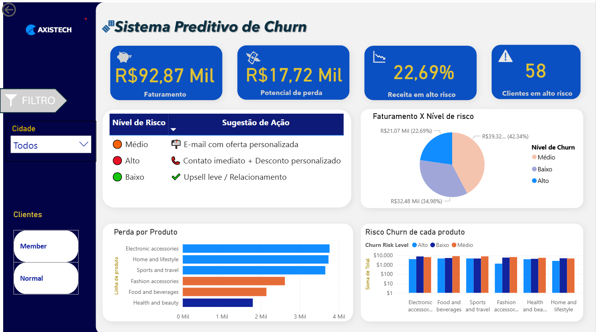

## 📊 Dashboard

Nosso projeto teve como foco o churn no varejo, ou seja, a perda de clientes em determinado período, fator que impacta diretamente a lucratividade e sustentabilidade do negócio. Para enfrentar esse desafio, desenvolvemos um modelo preditivo baseado em árvore de decisão, com acurácia acima de 80%, capaz de identificar clientes em diferentes níveis de risco de churn. Esses resultados foram tratados e apresentados em um dashboard interativo no Power BI, que oferece uma visão clara e prática sobre o perfil dos clientes, regiões mais críticas e receita em risco, permitindo que a empresa tome ações estratégicas e direcionadas para retenção e fidelização.

Para conferir meu dashboard completo interativo no Power BI apenas clique nele:

